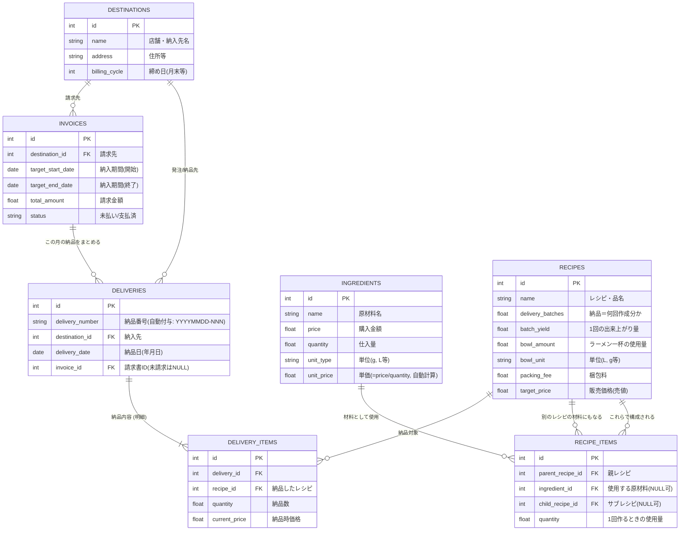

# 要件定義書: かえし等原価・納品管理Webアプリ

## 1. プロジェクト概要
Googleスプレッドシート上で構築されていた「かえし原価計算・納品書作成」の仕組みをWebアプリケーション化する。
単なる個別計算ツールではなく、レシピ同士の依存関係（例: 「からネギのたれ」が、別のレシピである「かえし」を材料とする等）を正確に管理・連動させ、さらに納品履歴から納品明細（金額）や月次請求書を自動算出できる包括的なレシピ・販売管理システムとする。

## 2. 目的・ゴール
1. **原価計算の自動化・可視化**: 基礎となる材料の単価・使用量から、1回の作成費用や、ラーメン1杯あたりの原価、粗利などを自動算出する。
2. **レシピ間の依存関係の解決**: 特定のベースのタレ（かえし等）の原価が変動すれば、それを使用している派生レシピの原価も一瞬で自動更新されるシステムの実現。
3. **納品管理の効率化**: 過去の納品履歴データを記録し、店舗に対する納品明細を自動で算出する。
4. **請求業務の自動化**: 納入先を登録・管理し、日々の納品履歴から「一ヶ月ごとの請求書」を自動計算・発行可能にする。

## 3. ユースケース
実際の業務に基づき、以下のユースケースを全てカバーするシステムとします。
1. **材料買付・仕入時**：材料を買ってきたときに「材料名」「価格（購入金額）」「量（仕入量）」を入力する。単価は価格÷量で自動算出される。
2. **レシピ考案時**：レシピを考えたときに「品名」「販売価格」「納品＝何回作成分か」「1回の出来上がり量」「ラーメン一杯の使用量（量・単位）」と、それに必要な複数の「材料名」「1回作るときの使用量」を入力する。
3. **納入時**：納入するときに「年月日」「納品先」と複数の「品名」「納品数」を入力する。「納品番号」はシステムが自動付与する（日時＋連番形式）。
4. **請求業務**：納入期間と納品先を設定して、その期間に納入した内容の請求書（納品履歴（納品日時、品名、納品数、販売価格）、請求金額を記載）を作成する。

## 4. システム機能要件（ユースケース対応）
### 4.1. マスター管理機能（データ追加・編集）
- **材料仕入れのUI登録**（ユースケース1対応）: 材料を買ってきた際に、画面から材料の「材料名」「価格（購入金額）」「量（仕入量）」「単位」を新規追加・編集・削除できる機能。単価（＝価格÷量）はシステムが自動計算する。
- **納入先マスター**: 納品先の店舗や企業名などの連絡先・管理情報を登録・管理する機能。

### 4.2. レシピ・原価作成機能（ユースケース2対応）
- 新しいレシピ（品名）に対して以下の基本項目を入力する機能：
  - **品名**: レシピの名称
  - **販売価格**: 納入時の売値
  - **納品＝何回作成分か**（小数可）: 1回の納品が何回分の製造に相当するか（例: 3回分）
  - **1回の出来上がり量**: 1回の製造で出来上がる量（例: 2.0）
  - **ラーメン一杯の使用量**: 量と単位（例: 0.06 L）。**レシピレベル**で設定する。
  - **梱包料**: 固定費（任意）
- 指定したレシピをつくるための構成材料を複数入力できる構成画面。各材料について以下を入力：
  - **材料名**: 使用する原材料またはサブレシピ
  - **1回作るときの使用量**（小数可）: その材料の1回の製造あたりの使用量
- **ネスト構造対応**: 「レシピ」を別のレシピの「材料」として再利用可能な機能も維持・担保する。
- 自動計算される項目（リアルタイム表示）:
  - **1回の原価**: 構成材料の使用量×材料単価の合算
  - **納品原価**: 1回の原価 × 回数 + 梱包料
  - **ラーメン1杯の原価**: 1回の原価 ×（一杯使用量 ÷ 出来上がり量）
  - **粗利**: 販売価格 - 納品原価
  - **粗利率**（%）

### 4.3. 納入記録・請求書作成機能（ユースケース3, 4対応）
- **日々の納入記録機能**: 納入時に「年月日」「納品先」と、複数の「品名」および「納品数」を入力・登録できる画面。「納品番号」はシステムが `YYYYMMDD-NNN`（日付＋連番）形式で自動付与する。納品記録は編集・削除も可能とする。
- **請求書作成機能**: 「納入期間（開始日〜終了日）」と「納品先」を設定・絞り込みすることで、その期間に納入した内容の請求書を自動作成する機能。
  - 請求書作成後、**削除が可能**とする。請求書を削除した場合、その請求書に含まれていた納品記録の「請求書ID」はNULLに戻り、再度「未請求」の状態として扱われるようにする。
  - 請求書記載項目: **納品履歴（納品日時、品名、納品数、販売価格）** および **請求金額（合計額）** を記載する。

### 4.4. 編集・削除ルール
- **編集・削除可能**: 材料マスター、納入先マスター、レシピ（基本情報・構成材料）、納品記録、請求書

### 4.5. レスポンシブ対応
- **スマートフォンでの利用を想定**したモバイルファースト設計とする。
- 全画面がスマートフォン画面幅（320px〜）で快適に操作できること。
- **UIデザイン**: ボタンなどのUIパーツは、角を丸く（Border-radiusを大きく）設定し、親しみやすくモダンな印象を与えるものとする。

### 4.6. 認証・セキュリティ
- 管理者のみがデータにアクセス・編集できるようにするための連携/ログイン認証機能。
- データベースを持ち、スプレッドシートからは完全に独立した専用システムとする。

---

## 5. データモデルの関係性（概念設計）
今後の設計フェーズ（データベース設計）に向けた、本システムで扱う主要なデータの関係性（エンティティ）の初期整理です。

### 概念設計の超重要ポイント
1. **レシピの再帰（入れ子）構造**
   - 「からネギのたれ」の材料の中に「かえし」が含まれるように、レシピ構成（RecipeItems）には「原材料の実体データ」だけでなく「別のレシピデータ」も紐づけられるような柔軟な設計が必要です。
2. **納品と請求書の切り離し**
   - 昔ながらのエクセルとは違い、DBでは「日々の納品（Deliveries）」のデータをどんどん積み上げていきます。そして月末に、特定の『納入先』の1ヶ月分の納品データをガサッと集計して、1つの「請求書（Invoices）」データを作り出すという（1対多の）関係性になります。

   

